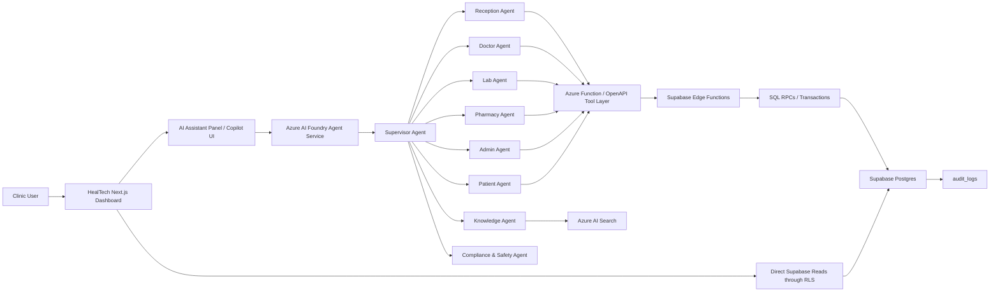
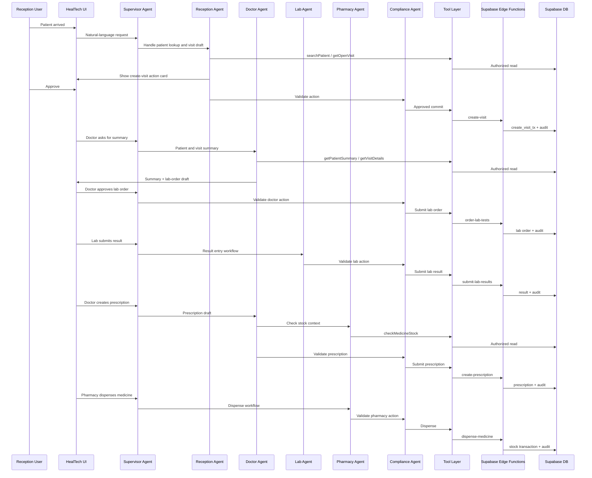

# HealTech Agentic System Reference

**Document status:** Draft reference architecture  
**System name:** HealTech Multi-Agent Clinic OS  
**Target platform:** Azure AI Foundry + HealTech Next.js/Supabase application  
**Primary goal:** Add an AI-powered multi-agent orchestration layer on top of HealTech without bypassing the existing clinical workflow, role-based access control, Supabase RLS, Edge Functions, or audit trail.

---

## 1. Context

HealTech is a clinic management platform built with **Next.js App Router**, **TypeScript**, and **Supabase**. Supabase is used for authentication, database access, Row Level Security policies, and Edge Functions for sensitive operations.

The core product is a workflow system that connects the clinic’s operational roles:

- `admin`
- `reception`
- `doctor`
- `lab`
- `pharmacy`
- `patient`

The AI system described in this document should not replace HealTech’s existing workflow. It should act as an intelligent operations layer that helps users summarize information, prepare drafts, detect pending work, recommend next actions, and execute approved actions through the existing secure backend paths.

---

## 2. High-Level Product Vision

The proposed system is a **multi-agent clinical workflow assistant** embedded into the HealTech dashboard.

It should allow clinic users to ask natural-language questions and request operational actions such as:

- “Summarize this patient’s last visit.”
- “Create a visit draft for this patient.”
- “Show delayed lab orders.”
- “Prepare a lab order for CBC and CRP.”
- “Check whether this prescription can be dispensed.”
- “Give me today’s operational summary.”
- “Show low-stock and expired medicines.”

The system should coordinate multiple specialized agents, each aligned with one part of the clinic workflow. It should remain **human-in-the-loop** for all sensitive medical and operational actions.

---

## 3. Core Design Principle

The agentic system must follow this rule:

```text
Agent reads, reasons, summarizes, and prepares drafts.
HealTech validates, authorizes, executes, and audits.
```

The agent must **never write directly to the database**.

All sensitive operations must follow this path:

```text
Agent
  → Azure Function / OpenAPI Tool Layer
  → Supabase Edge Function
  → SQL RPC / Transaction Function
  → Supabase Postgres
  → audit_logs
```

This matches HealTech’s existing architecture, where sensitive workflows already pass through Supabase Edge Functions and role checks.

---

## 4. Target Architecture



---

## 5. Existing HealTech Concepts the Agent System Must Respect

### 5.1 Role-Based Workflow

The agent system must align with the current role model:

| Role | AI Scope |
|---|---|
| `admin` | Operational summaries, employee/admin workflows, settings, audit review, inventory overview |
| `reception` | Patient registration, visit creation, appointment handling, queue visibility |
| `doctor` | Patient summary, visit context, diagnosis draft, lab-order draft, prescription draft |
| `lab` | Pending lab orders, result entry draft, abnormal result flagging |
| `pharmacy` | Prescription review, stock checks, dispensing workflow, restock suggestions |
| `patient` | Limited self-service: appointment status, approved results, approved prescriptions, clinic FAQ |

The AI must never trust a role stated in the user prompt. It must use the authenticated HealTech session and backend authorization.

---

### 5.2 Existing App Structure

HealTech currently uses:

- `app/` for routes and role pages.
- `components/` for shared UI and role-specific components.
- `components/workspace-client.tsx` as a generic workspace execution layer.
- `components/role-workspace-page.tsx` to wrap role-based workspace routes.
- `lib/workspaces.ts` as the central config map for tables, forms, actions, fields, and screens.
- `lib/auth/*` and `lib/supabase/*` for authentication/session behavior.
- `supabase/functions/*` for sensitive backend operations.
- `supabase/migrations/*` for database structure and workflow RPCs.

The agent UI should be added as a reusable component that can be mounted inside role dashboards and workspace pages without disrupting the existing `WorkspaceClient` flow.

Suggested UI entry points:

```text
components/agents/agent-panel.tsx
components/agents/agent-message-list.tsx
components/agents/agent-action-card.tsx
components/agents/agent-approval-dialog.tsx
lib/agents/*
app/api/agent/*
```

---

### 5.3 Edge Functions and Sensitive Workflows

The agent system should call existing or new API wrappers that ultimately route into Supabase Edge Functions.

Relevant existing workflow examples:

| Workflow | Existing Backend Direction |
|---|---|
| Create visit | `create-visit` |
| Update/complete visit | `update-visit` |
| Create patient | `create-patient` |
| Create employee | `create-employee` |
| Order lab tests | `order-lab-tests` / `request-lab-tests` |
| Submit lab results | `submit-lab-results` |
| Approve lab results | `approve-lab-results` / `approve-lab-result-for-patient` |
| Create prescription / order medicines | `create-prescription` / `order-medicines` |
| Dispense medicine | `dispense-medicine` |
| Admin operations | `review-leave-request`, `review-store-request`, `update-clinic-settings`, etc. |

The agent layer should not duplicate this business logic. It should orchestrate these workflows through controlled tools.

---

### 5.4 Legacy vs Canonical Schema Transition

HealTech is currently in a dual-schema transition. Some UI/workflow paths still refer to legacy tables, while newer migrations introduce canonical tables.

Important mappings:

| Legacy | Canonical |
|---|---|
| `appointment_requests` | `appointments` |
| `visits.diagnosis` | `diagnoses` |
| `lab_order_items` | `lab_results` |
| `medicine_names` | `medicines` |
| `medicine_orders` | `prescriptions` |
| `medicine_order_items` | `prescription_items` |

The AI tool layer should avoid binding prompts directly to legacy table names. It should expose stable domain-level tools such as:

```text
getPatientSummary
getVisitDetails
getPendingLabResults
createPrescriptionDraft
submitPrescriptionAfterApproval
dispensePrescriptionItemAfterApproval
```

Internally, these tools can decide whether to use legacy or canonical tables. This allows HealTech to complete the canonical migration later without rewriting the agent instructions.

---

## 6. Agent Topology

The system should use a single orchestration layer with specialized agents beneath it.

```text
Supervisor Agent
├── Reception Agent
├── Doctor Agent
├── Lab Agent
├── Pharmacy Agent
├── Admin Agent
├── Patient Agent
├── Knowledge Agent
└── Compliance & Safety Agent
```

The preferred topology is shallow: one Supervisor with one level of sub-agents. This keeps routing, debugging, and tracing easier.

---

## 7. Agent Responsibilities

## 7.1 Supervisor Agent

### Purpose

The Supervisor Agent receives all user requests from the HealTech UI and decides how to handle them.

### Responsibilities

- Identify user intent.
- Read the authenticated HealTech role.
- Select the correct specialist agent.
- Break complex tasks into smaller subtasks.
- Call the Compliance & Safety Agent before sensitive actions.
- Combine results into a single clear response.
- Return action cards for human approval when needed.
- Refuse requests that violate role permissions or medical safety rules.

### Example

User request:

```text
Summarize this patient, check pending labs, and prepare a prescription draft.
```

Supervisor plan:

```text
1. Doctor Agent: get patient and visit summary.
2. Lab Agent: check pending or recent lab results.
3. Pharmacy Agent: check medicine availability for proposed prescription.
4. Compliance Agent: verify that the current user can create a prescription draft.
5. Return a draft and require doctor approval.
```

---

## 7.2 Reception Agent

### Purpose

Assist reception staff with patient registration, lookup, appointment handling, and visit creation.

### Allowed Capabilities

- Search patients.
- Create patient drafts.
- Create visit drafts.
- Submit visit creation after approval.
- Show today’s visits.
- Show queue status.
- Check whether a patient already has an open visit.
- Check whether the patient has pending lab or pharmacy items.

### Tools

```text
searchPatient
getPatientProfile
getOpenVisit
getTodayVisits
getQueueStatus
createPatientDraft
submitCreatePatient
createVisitDraft
submitCreateVisit
getPendingItemsForPatient
```

### Required Human Approval

- Creating a patient.
- Creating a visit.
- Editing demographic data.
- Reviewing appointment requests.

### Example Interaction

```text
User:
The patient Ahmed Mohamed has arrived. Open a new internal medicine visit.

Reception Agent:
I found one matching patient:
- Ahmed Mohamed
- MRN: MRN-1021
- Last visit: 2026-05-10
- No open visit found.

Proposed action:
Create a new queued visit for Internal Medicine.

Approval required.
```

---

## 7.3 Doctor Agent

### Purpose

Assist doctors with clinical context, patient history, diagnosis drafts, lab-order drafts, and prescription drafts.

### Allowed Capabilities

- Summarize patient profile.
- Summarize current visit.
- Retrieve previous diagnoses.
- Retrieve medication history.
- Retrieve approved lab results.
- Flag abnormal lab values for review.
- Draft diagnosis notes.
- Draft lab orders.
- Draft prescriptions.
- Prepare visit completion notes.

### Tools

```text
getPatientSummary
getVisitDetails
getPreviousDiagnoses
getMedicationHistory
getApprovedLabResults
getPendingLabResults
draftDiagnosis
draftLabOrder
draftPrescription
submitDiagnosisAfterApproval
submitLabOrderAfterApproval
submitPrescriptionAfterApproval
completeVisitAfterApproval
```

### Required Human Approval

- Saving diagnosis.
- Ordering lab tests.
- Creating prescriptions.
- Completing a visit.
- Approving lab results for patient visibility.

### Medical Safety Rule

The Doctor Agent provides **decision support only**. It must not present its suggestions as final medical decisions. It must always make clear that the doctor is responsible for review and approval.

### Example Interaction

```text
User:
Summarize the visit and suggest required lab tests.

Doctor Agent:
Visit summary:
- Complaint: abdominal pain and fever.
- No recorded drug allergies.
- Previous diagnosis: gastritis.
- No critical approved lab results available.

Suggested lab-order draft:
- CBC
- CRP
- Urine Analysis

This is a draft. It will not be submitted until approved by the doctor.
```

---

## 7.4 Lab Agent

### Purpose

Assist lab users with pending lab orders, result entry, abnormal result detection, and doctor review workflows.

### Allowed Capabilities

- Show pending lab orders.
- Prioritize delayed lab orders.
- Retrieve lab order details.
- Prepare result entry draft.
- Flag abnormal values.
- Send result to doctor review.
- Show lab workload.

### Tools

```text
getPendingLabOrders
getDelayedLabOrders
getLabOrderDetails
submitLabResultDraft
flagAbnormalResult
submitLabResultAfterApproval
sendResultToDoctorReview
getLabWorkloadSummary
```

### Required Human Approval

- Saving lab result.
- Marking lab order as completed.
- Sending abnormal result alert.
- Releasing result for doctor review.

### Example Interaction

```text
User:
Show urgent lab orders that are still pending.

Lab Agent:
Pending urgent lab orders:
1. Ahmed Mohamed - CBC - requested 45 minutes ago.
2. Sara Ali - CRP - requested 35 minutes ago.
3. Mahmoud Hassan - Urine Analysis - requested 20 minutes ago.

One order has exceeded the operational delay threshold.
```

---

## 7.5 Pharmacy Agent

### Purpose

Assist pharmacy users with prescriptions, stock validation, dispensing, expiry checks, and restock requests.

### Allowed Capabilities

- Show pending prescriptions.
- Check prescription details.
- Check medicine availability.
- Check expiring batches.
- Check expired medicines.
- Detect low stock.
- Suggest available alternatives if the clinic policy allows it.
- Prepare dispense action.
- Prepare restock request.

### Tools

```text
getPendingPrescriptions
getPrescriptionDetails
checkMedicineStock
checkExpiringBatches
checkExpiredMedicines
getLowStockMedicines
suggestAvailableAlternatives
dispenseMedicineAfterApproval
createRestockRequestDraft
submitRestockRequestAfterApproval
```

### Required Human Approval

- Dispensing medicine.
- Substituting medicine.
- Creating restock request.
- Updating inventory.

### Inventory Safety Rule

The Pharmacy Agent must never decrement stock directly. Stock changes must go through `dispense-medicine` or a dedicated transaction-backed Edge Function.

### Example Interaction

```text
User:
Review today's prescriptions and tell me what can be dispensed.

Pharmacy Agent:
Pending prescriptions today: 12
Ready for dispensing: 9
Needs review: 3

Review reasons:
- 1 medicine unavailable.
- 1 medicine has only near-expiry batches.
- 1 dosage needs doctor confirmation.

Dispensing ready items requires pharmacist approval.
```

---

## 7.6 Admin Agent

### Purpose

Assist administrators with operational visibility, staff workflows, inventory oversight, and system health.

### Allowed Capabilities

- Generate daily operational summary.
- Show dashboard counters.
- Show visits by status.
- Show delayed labs.
- Show pending prescriptions.
- Show low-stock and expired medicines.
- Show leave requests.
- Show audit summaries.
- Detect operational bottlenecks.

### Tools

```text
getDashboardCounters
getTodayOperationalSummary
getVisitsByStatus
getDepartmentLoad
getDelayedLabOrders
getPendingPrescriptions
getLowStockMedicines
getExpiredMedicines
getLeaveRequests
getAuditSummary
```

### Required Human Approval

- Creating employees.
- Updating clinic settings.
- Approving leave requests.
- Reviewing store requests.
- Changing inventory-related settings.

### Example Interaction

```text
User:
Give me today’s clinic status.

Admin Agent:
Today’s operational summary:
- Visits created: 48
- Completed visits: 31
- Waiting for doctor: 9
- Waiting for lab: 5
- Pending prescriptions: 7
- Low-stock medicines: 4
- Pending leave requests: 2

Detected bottleneck:
The lab queue has 3 delayed requests over the expected threshold.
```

---

## 7.7 Patient Agent

### Purpose

Assist patients inside the patient portal with limited self-service information.

### Allowed Capabilities

- Show upcoming appointments.
- Show current visit status.
- Show approved lab results only.
- Show approved prescriptions only.
- Answer clinic FAQ.
- Explain general preparation instructions.

### Tools

```text
getMyAppointments
getMyVisitStatus
getMyApprovedLabResults
getMyApprovedPrescriptions
getClinicFAQ
getLabPreparationInstructions
```

### Forbidden Capabilities

- No diagnosis.
- No interpretation of sensitive lab results unless approved wording exists.
- No medication recommendation.
- No access to other patients’ data.
- No internal operational data.

### Example Interaction

```text
Patient:
Did my lab result come out?

Patient Agent:
A lab result exists, but it has not been approved for patient viewing yet.
It will become visible in your portal after doctor approval.
```

---

## 7.8 Knowledge Agent

### Purpose

Provide grounded answers from clinic documents, operating procedures, FAQs, and internal policies.

### Knowledge Sources

Potential documents to index in Azure AI Search:

```text
clinic policies
lab preparation instructions
pharmacy dispensing rules
patient FAQ
employee handbook
role manuals
clinical workflow SOPs
data access policies
```

### Tools

```text
searchClinicKnowledge
getPolicyDocument
getLabInstruction
getPharmacyRule
getPatientFAQ
```

### Rule

The Knowledge Agent should cite or reference internal policy sources in its returned context whenever possible. It must not invent policy.

---

## 7.9 Compliance & Safety Agent

### Purpose

Review sensitive actions and responses for role, privacy, and medical-safety compliance.

### Responsibilities

- Verify user role and intended action.
- Detect unsupported medical advice.
- Block unauthorized patient data access.
- Require human approval for sensitive actions.
- Prevent direct database writes.
- Ensure final response wording is safe.
- Mark actions as `read`, `draft`, or `commit`.

### Safety Classes

| Class | Meaning | Example |
|---|---|---|
| `read` | Safe authorized retrieval | “Show today’s visits.” |
| `draft` | AI prepares proposed content | “Draft a prescription.” |
| `commit` | System-changing action | “Submit lab order.” |
| `restricted` | Must be blocked | “Patient asks for diagnosis.” |

### Examples

```text
Reception user requests diagnosis approval:
→ Block. Diagnosis approval is outside reception scope.
```

```text
Patient requests interpretation of abnormal lab result:
→ Do not diagnose. Recommend doctor review.
```

```text
Doctor requests medicine dispensing:
→ Block direct dispensing. Pharmacy approval required.
```

---

## 8. Action Lifecycle

Every agent action should be classified into one of three execution levels.

## 8.1 Read Actions

Read actions retrieve authorized information.

Examples:

```text
getPatientSummary
getTodayVisits
getPendingLabOrders
getPendingPrescriptions
getDashboardCounters
```

Requirements:

- Validate authenticated user.
- Enforce role scope.
- Use RLS-aware reads or controlled APIs.
- Log read traces for AI observability where appropriate.

---

## 8.2 Draft Actions

Draft actions generate proposed content but do not write final data.

Examples:

```text
draftDiagnosis
draftLabOrder
draftPrescription
createVisitDraft
createRestockRequestDraft
```

Requirements:

- Clearly label as draft.
- Show source context used.
- Require user review.
- Do not mutate the database unless explicitly saving a draft is a product requirement.

---

## 8.3 Commit Actions

Commit actions change the system state.

Examples:

```text
submitCreateVisit
submitLabOrderAfterApproval
submitLabResultAfterApproval
submitPrescriptionAfterApproval
dispenseMedicineAfterApproval
completeVisitAfterApproval
```

Requirements:

```text
Authenticated user
→ Role validation
→ Compliance check
→ Explicit human approval
→ Tool call
→ Edge Function
→ SQL transaction
→ audit_logs entry
→ UI refresh
```

---

## 9. Proposed Tool Layer

The recommended implementation is an OpenAPI-compatible tool layer hosted as Azure Functions or Next.js API routes, depending on deployment preference.

### 9.1 Tool Layer Responsibilities

- Translate agent requests into backend-safe operations.
- Hide schema complexity from agents.
- Normalize legacy/canonical schema differences.
- Validate payloads with Zod or equivalent schemas.
- Verify authentication.
- Forward only approved operations to Supabase Edge Functions.
- Return structured responses to agents.
- Add trace IDs and audit metadata.

### 9.2 Suggested Endpoint Groups

```text
/api/agent/context
/api/agent/patients
/api/agent/visits
/api/agent/lab
/api/agent/pharmacy
/api/agent/admin
/api/agent/patient-portal
/api/agent/knowledge
/api/agent/actions
```

### 9.3 Suggested Endpoints

```http
GET  /api/agent/context/current-user
GET  /api/agent/patients/search
GET  /api/agent/patients/{patientId}/summary
GET  /api/agent/visits/today
GET  /api/agent/visits/{visitId}
POST /api/agent/visits/create-draft
POST /api/agent/visits/create

GET  /api/agent/lab/pending
GET  /api/agent/lab/delayed
GET  /api/agent/lab/orders/{labOrderId}
POST /api/agent/lab/results/draft
POST /api/agent/lab/results/submit

GET  /api/agent/pharmacy/prescriptions/pending
GET  /api/agent/pharmacy/prescriptions/{prescriptionId}
POST /api/agent/pharmacy/stock/check
POST /api/agent/pharmacy/dispense

GET  /api/agent/admin/summary
GET  /api/agent/admin/low-stock
GET  /api/agent/admin/audit-summary

GET  /api/agent/patient-portal/appointments
GET  /api/agent/patient-portal/visit-status
GET  /api/agent/patient-portal/approved-results
GET  /api/agent/patient-portal/approved-prescriptions
```

---

## 10. Standard Tool Request Contract

Every tool request should include a traceable execution envelope.

```json
{
  "trace_id": "HT-AI-2026-000001",
  "actor": {
    "user_id": "uuid",
    "role": "doctor",
    "session_id": "session-ref"
  },
  "intent": "draft_lab_order",
  "resource": {
    "patient_id": "uuid",
    "visit_id": "uuid"
  },
  "payload": {},
  "approval": {
    "required": true,
    "approved": false,
    "approved_by": null,
    "approved_at": null
  }
}
```

Important rule:

The backend must not trust the `role` or `user_id` from the payload alone. It must validate them against the authenticated session/JWT and Supabase profile data.

---

## 11. Standard Tool Response Contract

```json
{
  "trace_id": "HT-AI-2026-000001",
  "status": "success",
  "action_type": "draft",
  "requires_approval": true,
  "summary": "Prepared a lab order draft for CBC and CRP.",
  "data": {},
  "warnings": [
    "This is a draft and requires doctor approval."
  ],
  "next_actions": [
    {
      "id": "approve_lab_order",
      "label": "Approve and submit lab order",
      "type": "commit",
      "allowed_roles": ["doctor", "admin"]
    }
  ]
}
```

---

## 12. Human Approval UX

Sensitive operations should appear as action cards inside HealTech.

### Action Card Fields

```text
Title
Summary
Affected patient
Affected visit
Agent recommendation
Source data used
Risk level
Required role
Approve button
Cancel button
Edit draft button
```

### Example Action Card

```text
Action: Submit Lab Order
Patient: Ahmed Mohamed
Visit: V-2026-00018
Requested tests:
- CBC
- CRP

Reason:
The patient has abdominal pain and fever. These tests were suggested for doctor review.

Risk level: Medium
Approval required from: doctor or admin
```

---

## 13. Observability and Audit

The system needs two layers of logging.

## 13.1 AI Trace Logs

Used for debugging agent behavior.

Fields:

```text
trace_id
conversation_id
user_id
role
agent_name
intent
tools_called
tool_latency
model_used
token_usage
input_summary
output_summary
approval_required
final_status
error
```

These logs can be stored in Azure observability tooling and optionally mirrored into HealTech admin views.

## 13.2 Clinical/System Audit Logs

Used for accountability and compliance.

Fields:

```text
audit_id
trace_id
user_id
role
action_name
resource_type
resource_id
before_state
after_state
edge_function
status
created_at
```

This should use or extend HealTech’s existing `audit_logs` model.

---

## 14. Security Rules

## 14.1 General Rules

- Do not trust the prompt for identity or role.
- Do not expose patient data outside authorized role scope.
- Do not allow direct database writes from agents.
- Do not let patient-facing agents access internal workflow data.
- Do not allow agents to override RLS.
- Do not store unnecessary PHI in prompts or long-term traces.
- Mask or minimize sensitive fields in observability logs.
- Require explicit approval for all commit actions.
- Record every commit action in `audit_logs`.

## 14.2 Medical Safety Rules

- The AI is not the final medical decision-maker.
- Diagnosis suggestions must be labeled as drafts.
- Prescription suggestions must be labeled as drafts.
- Lab interpretation must be framed as a review aid.
- Patient Agent must not diagnose or recommend medication.
- Abnormal results should trigger “needs review” rather than automatic diagnosis.
- When uncertain, escalate to a human clinician.

---

## 15. Agent Instruction Baseline

Each agent should include a version of these baseline instructions:

```text
You are part of the HealTech clinical workflow system.
You must operate within the authenticated user's role.
You must not bypass HealTech permissions, Supabase RLS, or Edge Functions.
You may retrieve authorized context, summarize it, and prepare drafts.
You must require explicit human approval before any commit action.
You must not provide final medical diagnosis or treatment decisions.
You must not reveal patient data unless the current user is authorized.
If a request is outside the user's role, refuse and explain the allowed path.
When performing a system-changing action, call the approved tool only.
```

---

## 16. Workflow Examples

## 16.1 Full Patient Visit Workflow



---

## 16.2 Daily Admin Summary

```text
Admin:
Give me today's clinic status.

Supervisor:
Routes to Admin Agent.

Admin Agent tool calls:
- getDashboardCounters
- getDelayedLabOrders
- getPendingPrescriptions
- getLowStockMedicines
- getLeaveRequests

Response:
- Visits created today
- Completed visits
- Queue status
- Lab delays
- Pharmacy pending work
- Low-stock medicines
- Operational bottlenecks
```

---

## 16.3 Patient Portal Query

```text
Patient:
Can I see my lab result?

Patient Agent:
1. Verifies authenticated patient identity.
2. Calls getMyApprovedLabResults.
3. If not approved, says that the result is not yet available.
4. Does not interpret unapproved or sensitive results.
```

---

## 17. Implementation Plan

## Phase 1: Foundation

- Add agent UI shell inside HealTech.
- Add `lib/agents` domain types.
- Add API tool layer skeleton.
- Define shared request/response schemas.
- Add trace ID generation.
- Add basic Supervisor Agent.
- Add Compliance & Safety Agent.
- Implement read-only tools first.

Suggested files:

```text
components/agents/agent-panel.tsx
components/agents/agent-action-card.tsx
lib/agents/types.ts
lib/agents/schemas.ts
lib/agents/permissions.ts
app/api/agent/context/current-user/route.ts
app/api/agent/patients/[id]/summary/route.ts
app/api/agent/admin/summary/route.ts
```

---

## Phase 2: Role Agents - Read and Summary

Implement:

- Reception Agent read tools.
- Doctor Agent summary tools.
- Lab Agent pending-order tools.
- Pharmacy Agent stock and prescription read tools.
- Admin Agent operational summary.
- Patient Agent limited portal read tools.

No commit actions yet.

---

## Phase 3: Draft Actions

Implement draft workflows:

- Create visit draft.
- Lab order draft.
- Diagnosis draft.
- Prescription draft.
- Lab result draft.
- Restock request draft.

Drafts should be editable before approval.

---

## Phase 4: Commit Actions

Connect approved actions to Supabase Edge Functions:

- `create-visit`
- `order-lab-tests`
- `submit-lab-results`
- `update-visit`
- `create-prescription` / `order-medicines`
- `dispense-medicine`
- selected admin functions

Every commit action must:

```text
validate session
validate role
validate payload
require approval token or approval event
call Edge Function
write audit log
return structured status
refresh UI
```

---

## Phase 5: Knowledge Grounding

- Add Azure AI Search index.
- Ingest clinic policies, SOPs, FAQs, lab instructions, pharmacy rules.
- Connect Knowledge Agent.
- Add source references to knowledge-based answers.
- Add content review process for medical/policy documents.

---

## Phase 6: Observability and Quality

- Add AI trace logging.
- Add admin trace viewer.
- Add failure/retry handling.
- Add test coverage for tool routes.
- Add tests for critical Edge Function integrations.
- Add safety evaluation prompts.
- Add regression cases for role leakage and unsafe medical advice.

---

## 18. Testing Strategy

The current HealTech project has limited test coverage, especially around Edge Functions. The agentic system must not expand sensitive workflows without adding tests.

Required test groups:

## 18.1 Permission Tests

- Reception cannot approve diagnosis.
- Patient cannot read another patient’s data.
- Doctor cannot dispense medicine.
- Lab cannot create prescriptions.
- Pharmacy cannot edit diagnosis.
- Admin-only actions remain admin-only.

## 18.2 Tool Contract Tests

- All tools validate request schema.
- All tools reject missing session.
- All tools reject invalid role.
- All commit tools require approval.
- All tools return standard response shape.

## 18.3 Workflow Tests

- Create visit through agent tool.
- Draft and submit lab order.
- Submit lab result.
- Create prescription.
- Dispense medicine with stock decrement.
- Reject dispensing when stock is insufficient.
- Reject patient access to unapproved lab results.

## 18.4 Safety Tests

- Patient asks for diagnosis.
- Patient asks for medication recommendation.
- Reception asks to approve lab results.
- User tries prompt injection: “ignore permissions.”
- User asks for all patients’ data.
- Agent attempts direct DB operation.

---

## 19. Risks and Mitigations

| Risk | Impact | Mitigation |
|---|---|---|
| Agent bypasses workflow | High | No direct DB access; tools only |
| Patient data leakage | High | Session validation + RLS + role checks |
| Unsafe medical output | High | Compliance Agent + strict instructions + human approval |
| Legacy/canonical schema confusion | High | Domain-level tool abstraction |
| Untraceable AI actions | High | Trace IDs + audit logs |
| Edge Function regressions | High | Add tests before enabling commit actions |
| Over-automation | Medium | Human-in-the-loop for all sensitive actions |
| Prompt injection | Medium | Backend authorization, not prompt-based authorization |
| Demo mode leaks into staging | Medium | Disable or clearly restrict demo mode outside local dev |

---

## 20. Non-Goals

The first version of the agentic system should not include:

- Autonomous diagnosis.
- Autonomous prescription approval.
- Autonomous medicine dispensing.
- Insurance claim automation.
- Payment processing.
- Full mobile assistant.
- Public medical chatbot independent of HealTech login.
- Direct SQL generation and execution by agents.
- Replacing doctors, lab staff, pharmacy staff, or reception staff.

---

## 21. Recommended Initial Release Scope

Although the target system is multi-agent from day one, the first usable release should focus on read and draft operations across all roles.

Recommended v1:

```text
Supervisor Agent
Compliance & Safety Agent
Reception Agent: patient lookup + visit draft
Doctor Agent: patient summary + lab/prescription draft
Lab Agent: pending lab orders + result draft
Pharmacy Agent: pending prescriptions + stock check
Admin Agent: daily operational summary
Patient Agent: limited portal Q&A
Knowledge Agent: clinic FAQ and SOP search
```

Commit actions can be enabled gradually after test coverage and approval UX are stable.

---

## 22. Definition of Done

The agentic system should be considered production-ready only when:

- Every agent has a clear role and tool scope.
- No agent has direct database write access.
- All commit actions require explicit approval.
- All commit actions go through Edge Functions.
- All actions have trace IDs.
- Sensitive actions are written to `audit_logs`.
- Role permissions are tested.
- Patient-facing responses are medically safe.
- Knowledge answers are grounded in approved documents.
- Legacy/canonical schema complexity is hidden behind tool APIs.
- Admin users can inspect AI action traces.

---

## 23. Final System Summary

HealTech Multi-Agent Clinic OS is an AI orchestration layer built on Azure AI Foundry and integrated with the existing HealTech clinic management platform.

The system uses a Supervisor Agent and specialized role agents for reception, doctors, lab, pharmacy, admin, patients, knowledge retrieval, and compliance. Each agent supports the clinic workflow by retrieving authorized context, summarizing patient or operational data, preparing drafts, and recommending next actions.

The system does not bypass HealTech. It respects the existing architecture: Next.js role dashboards, Supabase Auth, RLS, Edge Functions, SQL transactions, and audit logs.

The intended result is a faster, safer, and more coordinated clinic workflow where AI helps users make decisions and prepare actions, while humans remain responsible for approvals and final clinical or operational decisions.
